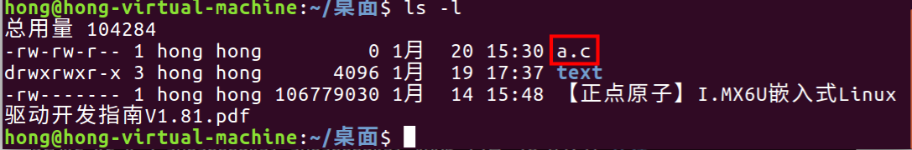
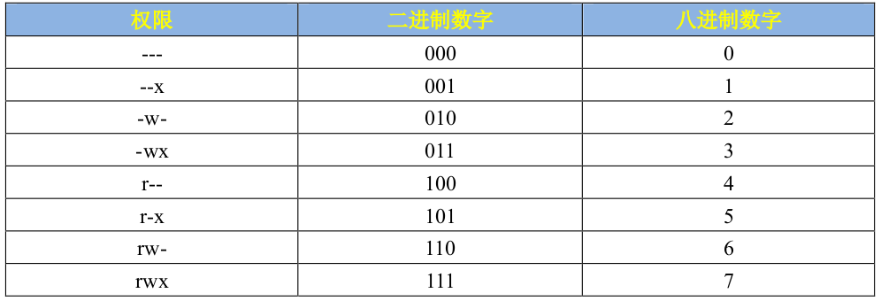
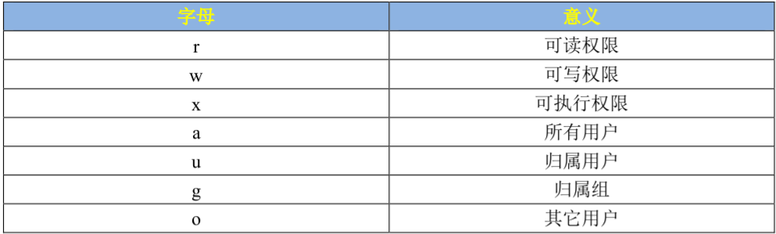
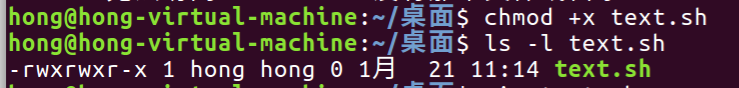
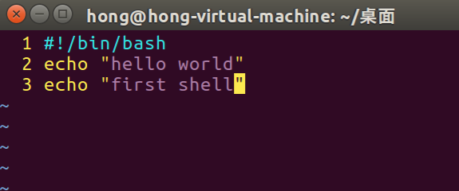

# Linux学习笔记
参考文档为：【正点原子】I.MX6U嵌入式Linux驱动开发指南V1.81.pdf
## 一、一些shell命令
- ls: 列出当前目录下的文件和子目录
  - ls -a: 列出所有文件，包括隐藏文件，例如以.开头的文件
  - ls -l: 以长格式列出文件和目录，包括权限、所有者、大小、修改时间等信息
  - ls path: 列出path目录下的文件和子目录
- cd: 切换当前目录
- pwd: 显示当前所在目录的路径
- clear: 清除屏幕上的内容，使命令行界面更加清晰
- uname: 显示系统信息，例如内核版本、操作系统名称等
- cat: 查看文件内容
  - cat filename: 查看filename文件的内容
  - cat path/filename: 查看path目录下filename文件的内容
- sudo: 以超级用户权限执行命令
  - sudo apt-get install package: 安装package软件包
  - sudo su: 切换到超级用户（root）权限     
  - exit: 退出root权限
- ctrl+c：中断终端命令，在执行命令的过程中，如果需要中断命令的执行，可以使用Ctrl+C组合键。
- touch: 创建一个空文件
  - touch filename: 创建一个空文件filename
- cp: 复制文件
  - cp filename1 filename2: 复制文件filename1到filename2
- rm: 删除文件
  - rm filename: 删除文件filename
- mkdir: 创建目录(创建文件夹)
  - mkdir dirname: 创建目录dirname
  - rmdir dirname: 删除空目录dirname
  - rm -r dirname: 删除非空目录dirname    
- mv: 移动文件，文件重命名       
  - mv filename1 filename2: 移动文件filename1到filename2，相当于是将filename1重命名为filename2
  - mv dirname1 dirname2: 移动目录dirname1到dirname2
  - mv filename dirname: 移动文件filename到目录dirname
- ifconfig: 显示网络接口信息
- reboot: 重启系统
- poweroff: 关闭系统
- sync: 同步内存中的数据到硬盘
- find: 查找文件或目录
  - find -name filename: 在当前目录下查找文件名(filename)，这里是省略了查找起始路径，默认用当前目录 .
  - find path -name filename: 在path目录下查找文件名(filename)
- ./:是 .（当前目录）和 /（Linux 路径分隔符）的结合，核心作用是明确指定「当前目录下的某个文件 / 程序」
- .:. 是 Linux 中对「当前你所在的目录」的简写符号，是最基础、最常用的路径标识，没有任何额外操作，单纯指代目录本身。
- du: 显示目录或文件的磁盘占用空间
  - du -h: 以人类可读的格式显示磁盘占用空间，例如1K、2M、3G等
  - du -h filename: 显示filename文件的磁盘占用空间，-h 表示人类可读的格式
  - du -sh dirname: 显示dirname目录的磁盘占用空间
    - -s:只显示目录占用空间的大小，不要显示其下子目录和文件占用的大小。
- gedit: 打开文本编辑器，用于编辑文本文件
  - gedit filename: 打开filename文件，用于编辑
- top: 显示系统资源占用情况，包括CPU、内存、进程等
  - 按q键退出top界面
- file: 显示文件类型
  - file filename: 显示filename文件的类型
- echo: 输出文本
  - echo "hello world": 输出hello world
## 二、安装软件的方法
- sudo apt-get install package(sudo apt install package): 安装package软件包
- 下载.deb软件包
  - 下载.deb文件到本地，例如package.deb
  - sudo dpkg -i package.deb: 安装package.deb软件包
- 删除.deb软件包安装的软件
```bash
dpkg -l | grep package # 先查看package软件包的包名
sudo apt purge package # 彻底删除软件，包括配置文件
```
## 三、vim编辑器的使用
- vim filename（vi filename）: 新建一个文件filename，进入vim编辑器。
一般刚刚进入vim编辑器时，默认是以只读模式打开文档，要编辑的话得切换到输入模式。
  - i:在当前光标所在字符的前面，转为插入模式
  - a:在当前光标所在字符的后面，转为插入模式，也是常用的插入模式。
  - o: 在当前光标所在行的下面，插入一个新行，转为插入模式
- esc: 退出插入模式，返回正常模式(只读模式)
- 退出vim编辑器时，需要先输入esc键退出插入模式，然后输入:wq键保存并退出，或者输入:q!键不保存并退出。如果没有编辑文字，也可也直接esc+:q退出。
下面的操作都是在普通模式（esc）下使用：
- dd：删除当前光标所在行
- u: 撤销上一次操作
- .: 重复上一次操作
- yy: 复制当前光标所在行
- p: 粘贴复制的内容
- 一般复制粘贴可以这样，先复制，复制的方法有yy、yw、v+y，再配合上p进行粘贴
  - yy:复制当前光标所在行
  - yw:复制当前光标所在单词   
  - v+y: 可视化选择复制，先按v进入可视化模式，然后用方向键选中要复制的内容，最后按y复制。
- v+d: 可视化选择删除，先按v进入可视化模式，然后用方向键选中要删除的内容，最后按d删除。
- 还可以用数字表示重复操作
  - 2yy: 复制当前光标所在行下面的2行
  - 3dd: 删除当前光标所在行下面的3行
- 一些光标移动常用方法：
  - 0: 移动到当前行的开头
  - $: 移动到当前行的结尾
  - gg: 移动到文件的开头
  - G: 移动到文件的结尾
  - nG: 移动到文件的第n行
## 四、Ubantu文件系统
在linux中“/”是根目录，所有的文件和目录都在根目录下，根目录下有很多子目录，每个子目录都有自己的作用。
- /bin: 存放系统最基本的二进制可执行文件，包括一些常用的命令，如ls、cp、mv等。
- /boot: 存放系统启动时需要的文件，如内核文件、引导加载程序等。
- /cdrom: 存放挂载的CD-ROM设备的挂载点。
- /dev: 存放设备驱动文件，如鼠标、键盘、硬盘等。
- /etc: 存放系统配置文件，如网络配置、用户配置例如用户账号密码等。
- /home: 存放用户的个人目录，每个用户都有一个对应的目录，用于存储个人文件和配置。
- /lib: 存放系统库文件，如动态链接库等。
- /media: 存放可移动媒体设备的挂载点，如USB闪存盘、CD-ROM等。
- /mnt: 存放临时挂载点，用于挂载其他文件系统。
- /opt: 存放可选的应用程序软件包，如第三方软件等。
- /proc: 存放系统运行时的进程信息和统计数据。
- /root: 存放root用户的个人目录，与/home目录不同，/root目录是系统管理员的个人目录。
- /sbin: 存放系统管理员使用的可执行文件，如系统管理命令等。
- /srv: 存放服务相关的文件和目录，如Web服务器的网站文件等。
- /sys: 存放系统设备和驱动程序的信息。
- /tmp: 存放临时文件，系统会定期清理该目录下的文件。
- /usr: usr不是user的缩写，而是UNIX System Resource的缩写，存放用户级别的应用程序和文件，如用户安装的软件包等。
- /var: 存放可变的文件，如日志文件、邮件队列等。
## 五、Ubantu下压缩和解压缩
常用的压缩扩展名有.tar、.tar.gz、.tar.bz2等。
### gzip压缩工具
gzip工具负责压缩.gz格式的文件
- gzip filename: 压缩filename文件，生成filename.gz文件
- gzip -d filename.gz: 解压缩filename.gz文件，生成filename文件
- gzip -r dirname: 递归压缩dirname目录下的所有文件，只是对目录下的文件进行压缩，不提供打包服务。
- gzip -rd dirname.gz: 递归解压缩dirname.gz目录下的所有文件，生成dirname目录
### bzip2压缩工具
bzip2工具负责压缩.bz2格式的文件
- bzip2 filename: 压缩filename文件，生成filename.bz2文件
- bzip2 -d filename.bz2: 解压缩filename.bz2文件，生成filename文件
也只是压缩目录下的文件，不提供打包服务。
### tar打包工具
- v: 显示打包过程中的详细信息
- c: 创建一个新的tar包
- j: 压缩/解压缩tar包中的文件，使用bzip2压缩算法
- z: 压缩/解压缩tar包中的文件，使用gzip压缩算法
- f: 指定tar包的文件名
- x: 从tar包中提取文件
```bash
# 先创建tar包，再压缩tar包
tar -vcjf test1.tar.bz2 test1 # 压缩成.bz2的形式
tar -vczf test1.tar.gz test1 # 压缩成.gz的形式

# 解压缩文件
tar -vxjf test1.tar.bz2 # 解压缩.bz2的形式
tar -vxzf test1.tar.gz # 解压缩.gz的形式
``` 
## 六 Linux下用户权限管理（文档2.7）
在安装 Ubuntu 系统的时候会要求创建一个账户,当我们创建好账号以后,系统会在目录/home 下以该用户名创建一个文件夹,所有与该用户有关的文件都会被存储在这个文件文件夹中。同样的,创建其它用户账号的时候也会在目录/home 下生成一个文件夹来存储该用户的文件。装系统的时候创建的用户其权限比后面创建的用户大一点,但是没有 root 用户权限大,Ubuntu 下用户类型分为以下 3 类:
- 初次创建的用户,此用户可以完成比普通用户更多的功能。
- 普通用户,安装完操作系统之后被创建的用户，此用户只能完成普通的文件操作,不能进行系统管理等操作。
- root 用户,此用户是系统管理员,可以完成所有的系统管理操作,如安装软件、配置网络等。
在下面这个图里，显示了桌面一些文件的权限：
>-rw-rw-r-- 1 hong hong         0 1月  20 15:30 a.c

在这一行中，前面“-rw-rw-r--”表示文件的权限，三个为一组分别对应文件所有者、文件所有者所在组、其他用户的权限。例如“rw-”是文件所有者hong的权限，“rw-”是文件所有者所在组hong的权限，“r--”是其他用户的权限。

权限对应的二进制数字如下图所示，例如101->r-x，表示文件可以被读被执行，不能被写。

文件权限修改字母表示方式：


权限管理命令：
```bash
# 权限修改命令chmod
# chmod [参数] [文件名/目录名]
chmod 755 filename # 给filename文件设置权限为755
chmod g+w filename # 给filename文件的文件所有者所在组添加写权限

# 命令 chown 用来修改某个文件或者目录的归属者用户或者用户组
# chown [参数] [用户名/用户组名] [文件名/目录名]
chown root filename # 把filename文件的归属者用户改为root
```
## 七 Makefile基础（文档3.3）
当源码文件比较多的时候就不适合通过gcc直接编译，因为每次修改一个文件都需要重新编译所有的文件，效率比较低。这时候就需要一个自动化的编译工具。<br>
make工具：一般指的是GNU Make工具，用于将源代码文件编译成可执行的二进制文件，make工具主要用于完成自动化编译。make工具编译的时候需要Makefile文件提供编译文件。<br>
Makefile文件：make工具使用的文件，指明了编译规则。<br>
简单Makefile示例：
```bash
# 先定义一个Makefile文件，用来存放代码，名字必须为Makefile
  main: main.o input.o calcu.o 
    gcc -o main main.o input.o calcu.o
  main.o: main.c
    gcc -c main.c
  input.o: input.c
    gcc -c input.c
  calcu.o: calcu.c
    gcc -c calcu.c

  clean:
    rm *.o
    rm main
```
Makefile规格格式如下：命令前都需要有一个tab键
> 目标...... : 依赖文件集合......
> [tab] 命令 1
>       命令 2
>       ......

例如下面这个规则：
>  main: main.o input.o calcu.o 
>    gcc -o main main.o input.o calcu.o

规则的目标是 main，main.o、input.o 和 calcu.o 是生成 main 的依赖文件，如果要更新目标 main，就必须先更新它的所有依赖文件（main.o、input.o 和 calcu.o）,如果依赖文件中的任何一个有更新,那么目标也必须更新,“更新”就是执行一遍规则中的命令列表。<br>
>  clean:
>    rm *.o
>    rm main

这个规则,它没有依赖文件,因此会默认为依赖文件都是最新的,所以其对应的命令不会执行,当我们想要执行 clean 的话可以直接使用命令“make clean”,执行以后就会删除当前目录下所有的.o 文件以及 main,因此 clean 的功能就是完成工程的清理<br>
Makefile 编写好以后我们就可以使用 make 命令来编译我们的工程了,直接在命令行中输入“make”即可,make 命令会在当前目录下查找是否存在“Makefile”这个文件,如果存在的话就会按照 Makefile 里面定义的编译方式进行编译<br>

Make 的执行过程，目的就是要实现自动化编译。
1. make 命令会在当前目录下查找以 Makefile(makefile 其实也可以)命名的文件。
2. 当找到 Makefile 文件以后就会按照 Makefile 中定义的规则去编译生成最终的目标文件。
3. 当发现目标文件不存在,或者目标所依赖的文件比目标文件新(也就是最后修改时间比目标文件晚)的话就会执行后面的命令来更新目标。
### Makefile语法（文档3.4）
## 八 shell脚本（视频正点源子linux第一期第18讲）
shell脚本就是将终端中一条一条输入的命令放入一个脚本文件中,然后通过执行这个脚本文件来完成一系列的命令操作。<br>
### shell脚本语法
shell脚本是纯文本文件，命令从上往下执行，脚本扩展名为.sh，同时脚本第一行一定要为：`#!/bin/bash`，表示使用bash shell来执行脚本中的命令。<br>
下面展示简单的一个shell脚本的创建和运行：
```bash
# 先创建一个shell脚本文件，名字为test.sh
touch test.sh
# 给test.sh文件添加可执行权限
chmod +x test.sh
# 编辑test.sh文件，添加以下内容
#!/bin/bash
echo "hello world"
# 运行test.sh脚本
./test.sh
```
先是创建一个shell脚本，通过ls可以发现这个创建的脚本没有可执行的权限。

通过chmod +x test.sh给test.sh文件添加可执行权限后，就可以通过./test.sh来运行这个脚本了。

通过vim打开脚本文件，在里面输入了一些内容

最后运行结果

剩下其他用法等后面用到再仔细研究。