阅读代码ml_5class.py，代码训练用的数据集在data_process，数据是摄像头受到不同ddos攻击采集的电流数据，现在我在利用这些数据进行训练，现在我把实验的过程告诉你，你来帮我看看判断的对不对，一开始代码里面分配训练集和验证集是按随机划分的，70%是训练集30%是验证集，步长为1、窗口大小为30，运行准确率能有90%多，我就怀疑是不是有数据泄露，后面我将步长改成5，准确率70%多，改成10之后只有50%，后面询问大模型后，说存在数据泄露，它让我将数据集分配的方式修改一下，也就是现在代码里这样，将原本随机分配给改成了按时间分配，时间前70%的为训练集，后30%为验证集，步长还是1，运行结果准确率30%多，我想知道1. 现在这个代码是不是正确的，有没有解决数据泄露的问题。2. 如果是的话，那是不是数据泄露的原因是数据集分配的问题，而不是因为步长的大小。

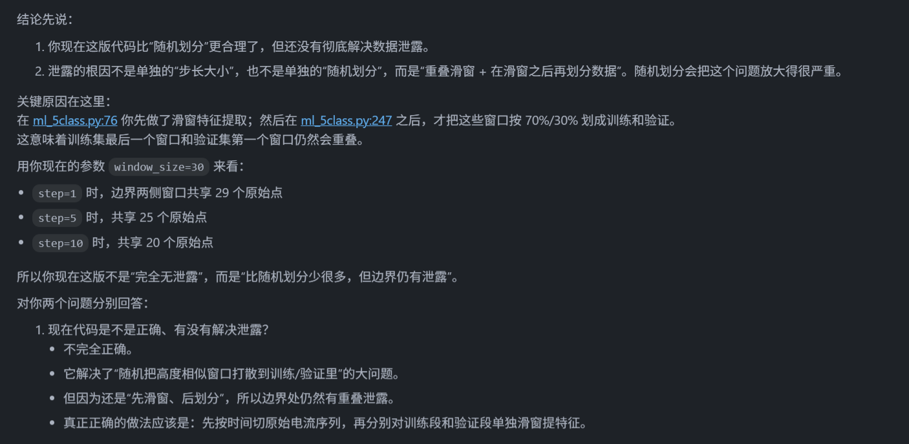
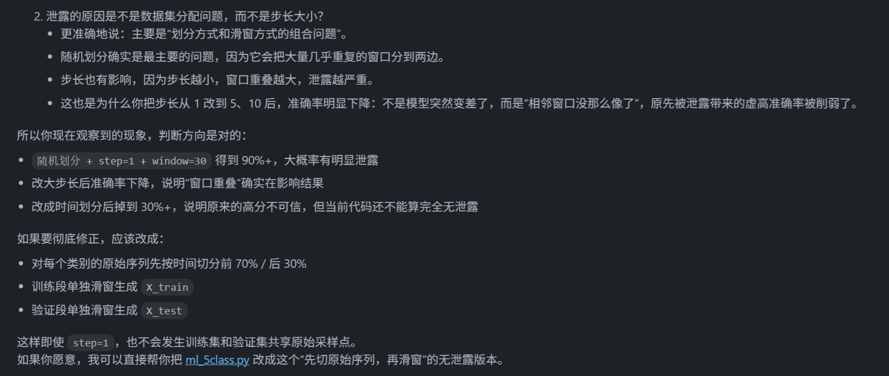
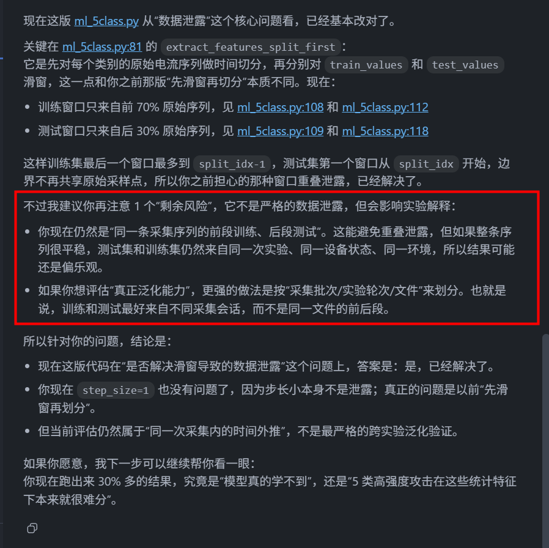

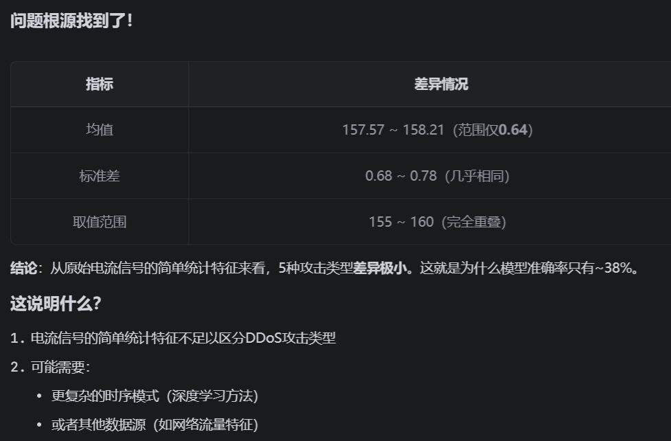

发现udp根本就学习不到，对udp数据进行了分析。
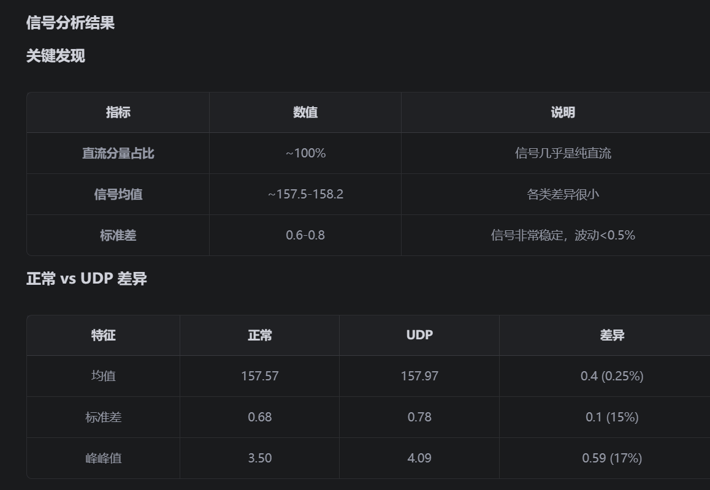
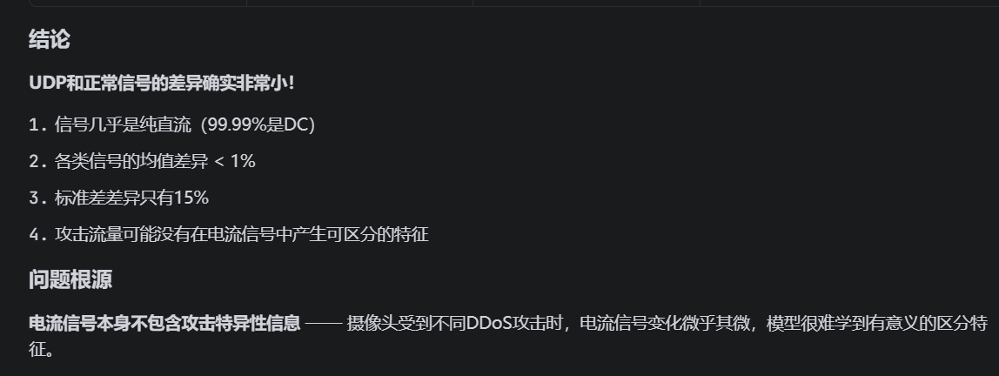

1240Hz数据窗口大小和步长的选择：
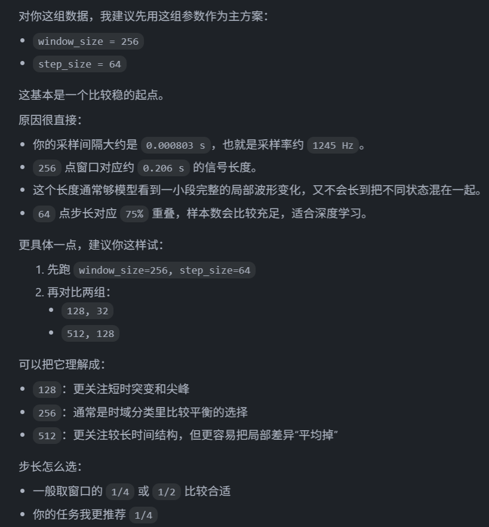
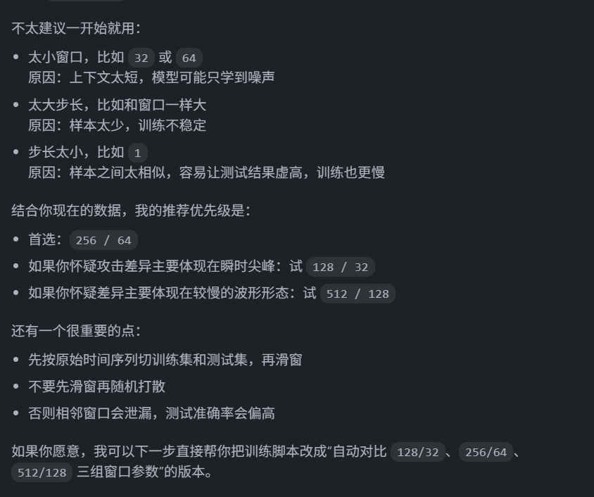

采集数据：
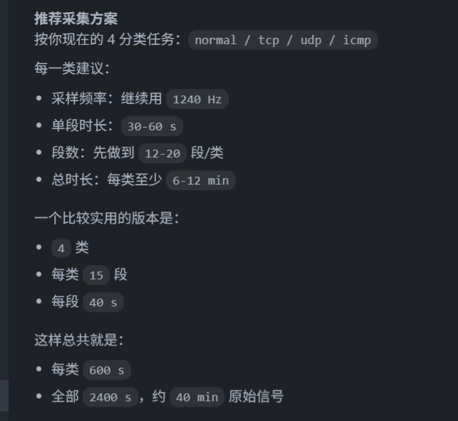
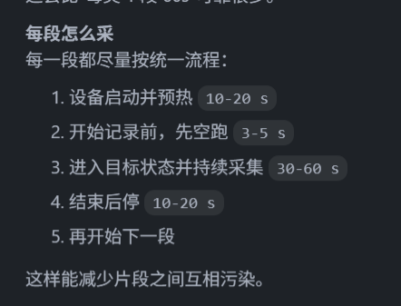

待尝试的方法：
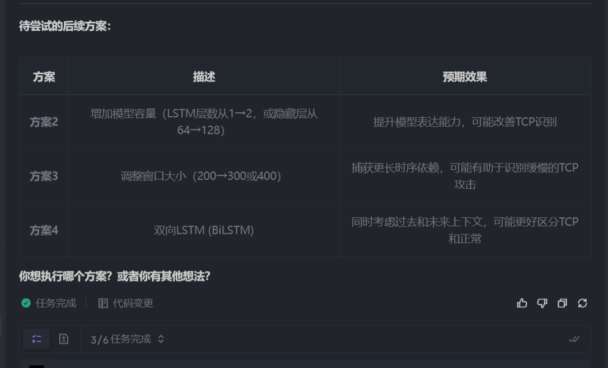
原始数据 → 先按时间切分 → 分别滑窗提取特征 → 训练/测试集
