# git学习笔记
一些git命令汇总表
学习视频的链接：[git学习视频](https://www.bilibili.com/list/watchlater?oid=528356813&bvid=BV1HM411377j&spm_id_from=333.1007.top_right_bar_window_view_later.content.click)

## 1. 初始化设置
```bash
git config --global user.name "your name" # 配置全局用户名
git config --global user.email "your email" # 配置全局用户邮箱
git config --global credential.helper store # 将配置信息存储在本地
```

## 2. 创建仓库
```bash
# 创建本地仓库
git init # 在当前目录下初始化一个本地仓库
git init myrepo # 在当前目录初始化一个名为myrepo的本地仓库
# 下载远程仓库
git clone <remote-url> # 下载远程仓库到当前目录
git clone <remote-url> <local-directory> # 下载远程仓库到指定目录
```

## 3. git的几个区域
    - 工作目录：我们实际操作的目录
    - 暂存区：暂存我们对文件的修改，准备提交到本地仓库
    - 本地仓库：用于存储我们的代码版本历史记录，是git存储代码和版本信息的主要位置。
    - 远程仓库
    工作区->(git add)->暂存区->(git commit)->本地仓库

## 4. git文件的几种状态：
    - 未跟踪(untracked)：文件在工作区中存在，但未被git跟踪。
    - 已修改(modifed)：文件在工作区中被修改，还没保存到暂存区。
    - 已暂存(staged)：文件已被添加到暂存区，准备提交。
    - 已提交(committed)：文件已被提交到本地仓库，版本历史记录中。
    - 
## 5. 提交文件的命令
```bash
git status # 查看当前文件的状态
git add <file> # 将文件添加到暂存区
git rm --cached <file> # 将添加到暂存区的文件删除
git ls-files # 查看暂存区中的文件
git rm <file> # 将文件从工作区和暂存区删除。这里删除的文件必须得是提交到了本地仓库的文件，否则会报错。如果还在暂存区是删除不掉的，得使用`git rm --cached <file>`命令将文件从暂存区中删除。
git commit -m "commit message" # 将暂存区中的文件提交到本地仓库，并添加提交信息，要注意只会提交暂存区的文件，不会提交工作区的文件。
git add . # 将当前文件夹下的所有文件添加到暂存区，.表示当前文件夹
git log # 查看提交历史记录，按q退出
```
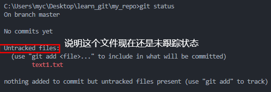
使用`git add`命令后
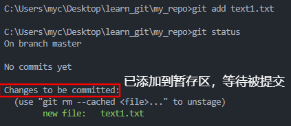
使用`git rm --cached <file>`命令将文件从暂存区中删除
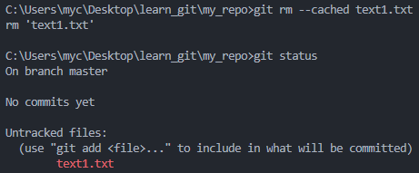
使用`git commit -m "commit message"`指令，后面要添加`-m`参数，用于添加提交信息。否则会进入交互式提交模式，需要手动输入提交信息，使用的是vim编辑器。
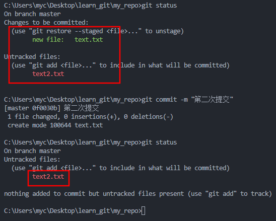
使用`git rm <file>`命令删除文件，可以看到工作区和暂存区的文件都被删除了。
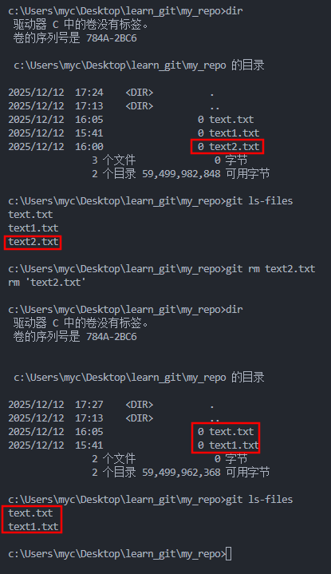

## 6. `git reset`命令的三种用法：
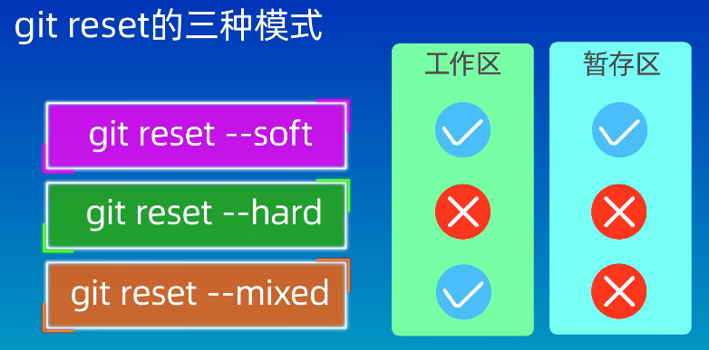
```bash
git reset --soft # 保存工作区和暂存区的内容
git reset --hard # 丢弃工作区和暂存区的内容
git reset --mixed # 保存工作区的内容，丢弃暂存区的内容
HEAD~1 # 上一个提交版本
HEAD~4 # 上4个提交版本
```
执行`git reset --soft`的结果,这里的实验前提是把文件一个一个传到仓库去的
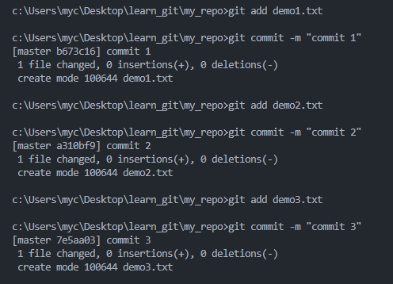
`git log`的结果为：
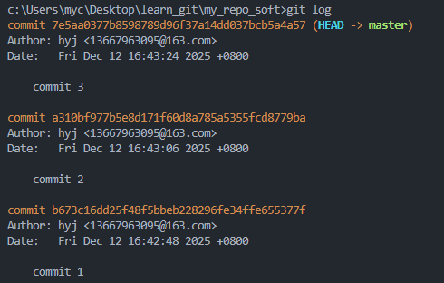
现在执行`git reset --soft HEAD~1`，可以看到回退到了上一次提交之后。
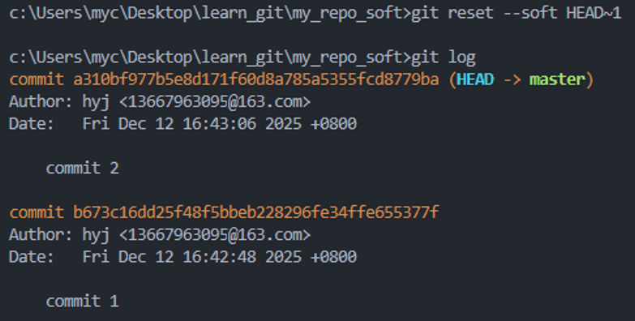
demo3也还存在在工作区和暂存区
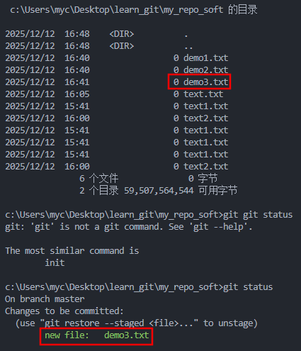
再执行`git reset --hard HEAD~1`，可以看到demo3被从工作区和暂存区中删除了。
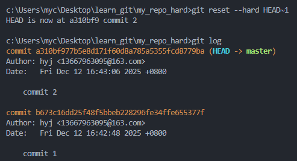
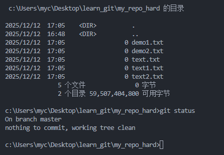

## 7. 工位电脑ssh的passphrase设置为：（回车）

## 8. 本地仓库与远程仓库
本地仓库（自己电脑上）和远程仓库（github托管的仓库）是相互独立的，互相修改都不会收到影响，要使用这两命令才能实现抓取和推送。先要提交到自己的仓库里面，再推送到远程仓库上。
```bash
git clone <remote-url> # 克隆远程仓库到当前目录
git pull # 从远程仓库抓取最新的代码到本地仓库
git push # 将本地仓库的代码推送到远程仓库
```
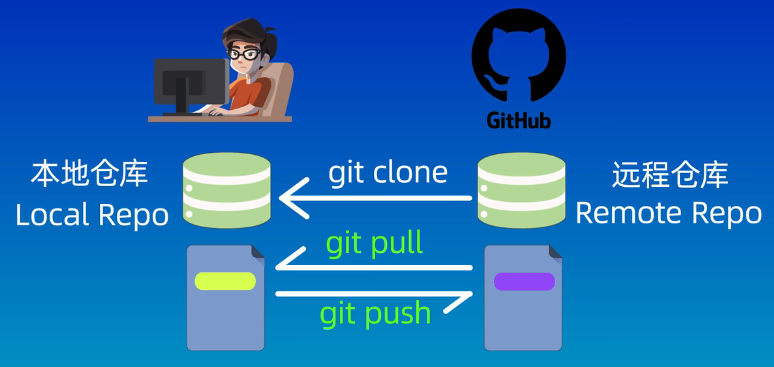

## 9. 推送本地仓库的代码到远程仓库
```bash
# 步骤如下：
git remote add origin git@github.com:hongyujie/experiment_repo.git # 添加远程仓库，origin是远程仓库的别名
git push -u origin master # 将本地仓库的master（main）分支推送到远程仓库的master（main）分支,这里要注意最后得看你是main分支还是master，我这里是master，所以输入main会报错。
```
`git remote add origin git@github.com:hongyujie/experiment_repo.git`命令中，后面链接的`hongyujie/experiment_repo.git`是你在github上创建的仓库的链接。
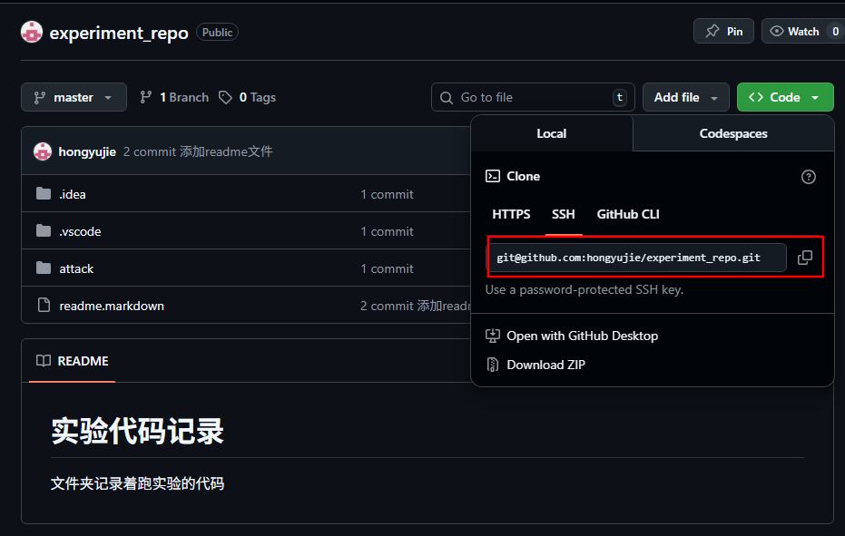

查看是master还是main分支
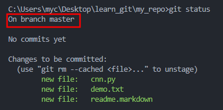

`git push`和`git push -u`的区别：
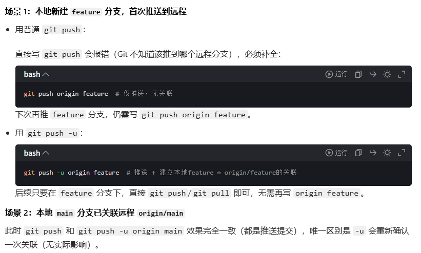

<span style="color:red;">要注意:</span>

一个本地 Git 仓库可以同时关联 gitHub 和 gitee 两个远程仓库（甚至更多），要对每个仓库进行区分，使用不同的远程仓库名。比如在上面步骤中，github的远程仓库名是origin，那么给gitee的远程仓库名就要换一个不能再是origin可以为gitee。相应的这两个命令也要修改成`git remote add gitee <url>`和`git push -u gitee master`
后面提交代码或者文件，`git push -u <远程仓库名><分支名>`命令也要写清楚，是提交到哪个远端仓库的哪个分支上。</br>
上面两种链接到远端仓库的方法（下面是部署在github上的方法，部署在gitee上的方法类似）：
1. （8. 本地仓库与远程仓库）步骤是：
     - 先在github上创建一个仓库
     - 执行`git clone`将远端仓库clone到本地仓库
     - 最后执行`git push`命令、`git pull`命令，将本地仓库代码推送到远端，或者拉取远端的代码到本地仓库。
2. （9. 推送本地仓库的代码到远程仓库）步骤是：
     - 先在github上创建一个仓库
     - 然后在本地仓库(这个仓库得先确保是git的仓库，即对文件夹执行过`git init`命令)中执行`git remote add origin git@github.com:hongyujie/experiment_repo.git`命令，将本地仓库与远程仓库关联起来。
     - 再执行`git push -u origin master`命令，将本地仓库的master分支推送到origin
     - 远程仓库的master分支。
     - 最后执行`git push`、`git pull`命令，将本地仓库代码推送到远端，或者拉取远端的代码到本地仓库。
     - 
## 10. 怎么样创建ssh密钥以及查询已经创建的ssh密钥
[创建ssh密钥](https://www.bilibili.com/list/watchlater?oid=528356813&bvid=BV1HM411377j&spm_id_from=333.1007.top_right_bar_window_view_later.content.click&p=11)
查找已有密钥步骤：
1. 打开终端（Mac/Linux）或命令提示符（Windows）。
2. 回到根目录下
   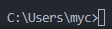
3. 进入ssh目录：
   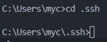
4. 访问下ssh文件夹，看看是不是存在公钥文件
   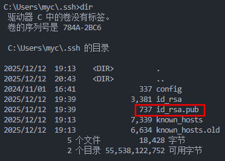
5. 打开公钥文件复制内容，这里是在vscode中打开的文件。
   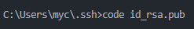

创建步骤：
1. 创建前先确保自己之前没有公钥，否则会覆盖掉之前的公钥。可以按上面的方法来进行查找。
2. 打开终端（Mac/Linux）或命令提示符（Windows）。
3. 回到根目录下
   
4. 进入ssh目录：
   
5. 输入指令创建密钥，配置的passphrase设置为：（回车）
```bash
ssh-keygen -t rsa -b 4096
```
6. 找到一个`.pub`后缀为文件，这个就是我们要的公钥，也是需要上传到github或者gitee上的内容。

## 11.分支
git中分支的作用：
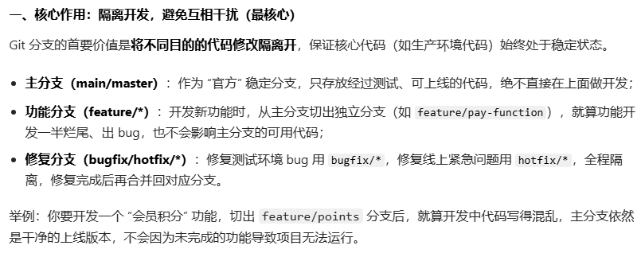

```bash
git branch # 查看当前分支
git branch -a # 查看所有分支
git branch <branch-name> # 创建一个新分支，这里只是创建分支，但还位于原来分支，需要切换到这个分支才能使用
git switch <branch-name> # 切换到指定分支
git merge <branch-name> # 合并指定分支到当前分支，<branch-name>是要合并的分支名，合并后<branch-name>分支还存在，只是内容被合并到当前分支。
``` 
## 12. .gitignore文件
.gitignore文件的作用是让我们忽略掉一些不应该被加入到版本库中的文件，让库体积更小更干净。

